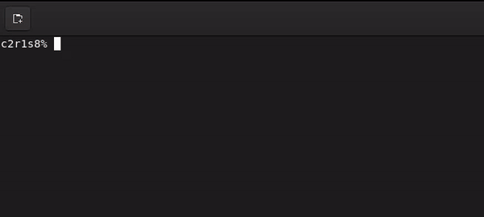

# SO_LONG 🐬

Projeto desenvolvido para o curso da 42 com o objetivo de criar um jogo 2D básico utilizando a MiniLibX, onde o jogador coleta itens e escapa de um mapa labiríntico. Inspirado no tema "So Long And Thanks for All the Fish!".

## 🧩 Sobre o Projeto

so_long é um jogo 2D onde o objetivo é coletar todos os itens colecionáveis do mapa e encontrar a saída para vencer. No estilo top-down, o jogador se movimenta usando as teclas de movimentação W, A, S e D ou, opcionalmente, as setas direcionais.

Apesar do tema proposto (delfins, peixes e Terra), é possível personalizar o jogo com personagens, colecionáveis e cenários diferentes.

## 🎯 Objetivos

- Mover o personagem pelas direções básicas.
- Evitar paredes e obstáculos durante o percurso.
- Coletar todos os itens antes de se dirigir à saída.
- Completar o mapa pelo menor número de movimentos possível.

##🗺️ Mapa

O jogo requer um arquivo .ber que descreve o mapa com os seguintes elementos:

- 0 para espaços livres.
- 1 para paredes.
- C para colecionáveis.
- E para a saída.
- P para a posição inicial do jogador.

**Exemplo de mapa:**

```
1111111111111
10010000000C1
1000011111001
1P0011E000001
1111111111111
```

## 🚀 Instruções de Compilação e Execução

Para compilar e executar o so_long, siga as instruções abaixo:

Pré-requisitos
MiniLibX instalada e configurada.

**Passo a Passo**

- Clone o repositório:
```
git clone <url-do-repositorio>
cd so_long
```

Compile o projeto com o comando make:
```
make
```

Executando o Jogo:
```
./so_long mapas/exemplo.ber
```

## 🕹️ Jogabilidade

Utilize as seguintes teclas para movimentar o personagem principal:

- **W ou ↑**: Mover para cima
- **A ou ←**: Mover para a esquerda
- **S ou ↓**: Mover para baixo
- **D ou →**: Mover para a direita
- **Objetivo**: Coletar todos os colecionáveis C e então dirigir-se ao ponto de saída E.

Durante o jogo, a quantidade de movimentos realizados é exibida no terminal. Se o mapa estiver incorreto (não for fechado por paredes, contiver múltiplas saídas ou posições iniciais), o jogo encerrará com uma mensagem de erro apropriada.

## 📸 Gameplay

Esse GIF mostra uma visão rápida da jogabilidade e do objetivo do jogo, onde o personagem coleta itens e encontra a saída.



## 🛠️ Estrutura do Projeto

- src/ - Contém os arquivos de código fonte.
- includes/ - Contém os headers, como so_long.h.
- maps/ - Contém os arquivos .ber de mapa.
- textures/ - Texturas e imagens usadas para personagens, colecionáveis e cenário.
- Makefile - Arquivo de compilação para gerar o executável so_long.

## 🧪 Testes
Para testar o jogo, você pode usar mapas adicionais na pasta maps/ ou criar novos mapas. Certifique-se de que todos os mapas estejam no formato .ber e respeitem as regras de configuração do mapa, como ser cercado por paredes e possuir uma saída, pelo menos um colecionável e uma posição inicial.

## ⚠️ Erros Comuns

- **Mapa Inválido**: Caso o mapa tenha múltiplas saídas, múltiplas posições iniciais, ou não seja fechado por paredes, o jogo exibirá um erro no terminal.
- **Erro ao Carregar o Mapa**: Verifique se o arquivo .ber está na pasta correta e possui o formato adequado.

